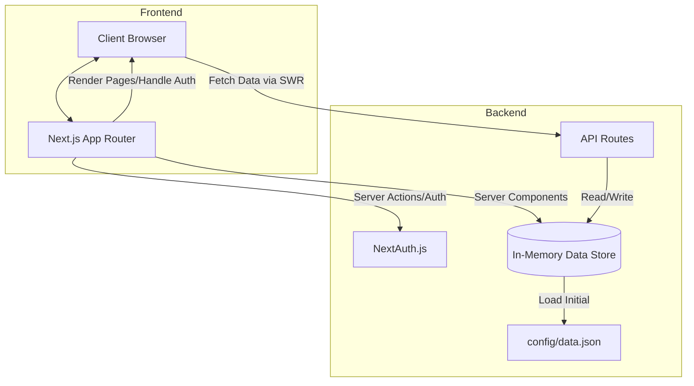
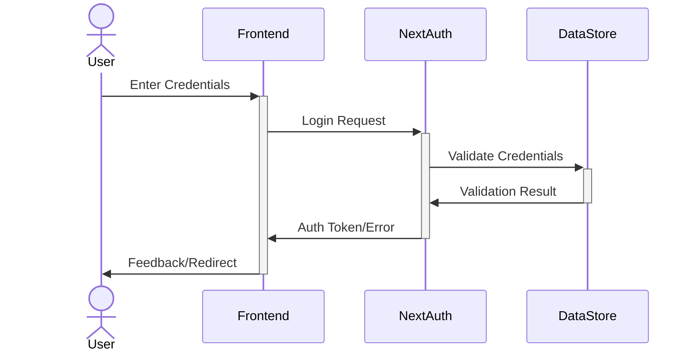
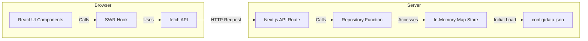

# System Architecture & Patterns

## Architecture Overview

The application follows a modern Next.js architecture with the App Router pattern, leveraging React Server Components where appropriate while ensuring client-side interactivity for testability.

## Key Design Patterns

1. **Repository Pattern** - Implemented for Users (`lib/db/repositories/users.ts` - `findUserByEmail`, `findUserById`, `addUser`, `updateUserPassword`, `updateUserProfile`) and News/Feeds (`lib/db/repositories/news.ts`). Data stored in `Map` objects.
2. **Service Layer** - Minimal; logic currently resides within API route handlers and repository functions.
3. **Component Composition** - Using HeroUI components (`Navbar.tsx`, `Card.tsx`, etc.).
4. **Client-Side Data Fetching** - Implemented using SWR hook in page components (`app/news/*`, `app/settings`).
5. **Configuration Loading** - Seed data loaded synchronously from `config/data.json` on server start within repositories.
6. **API Input Validation** - Using `Zod` schemas within API route handlers to validate incoming request bodies.
7. **Session Update Pattern (NextAuth)** - Using `useSession().update()` on the client and the `jwt` callback `trigger === 'update'` logic on the server to refresh session data (e.g., user name) without page reload.

## Implemented API Routes

- `GET /api/auth/session`: NextAuth session retrieval.
- `POST /api/auth/callback/credentials`: NextAuth credentials sign-in.
- `POST /api/auth/signup`: Handles new user registration.
- `GET /api/news/public`: Fetches all public news items.
- `GET /api/news/private`: Fetches private RSS feeds for the authenticated user.
- `POST /api/news/private`: Adds a new private RSS feed for the authenticated user.
- `DELETE /api/news/private`: Deletes a private RSS feed for the authenticated user.
- `GET /api/user`: Fetches profile data for the authenticated user.
- `PUT /api/user`: Updates profile data (name) for the authenticated user.
- `PUT /api/user/password`: Updates the password for the authenticated user.

## Authentication Flow

## Data Flow (Client-Side Fetching)

